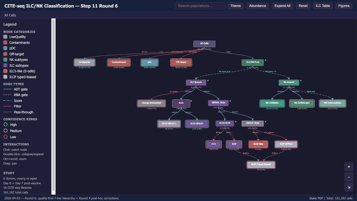
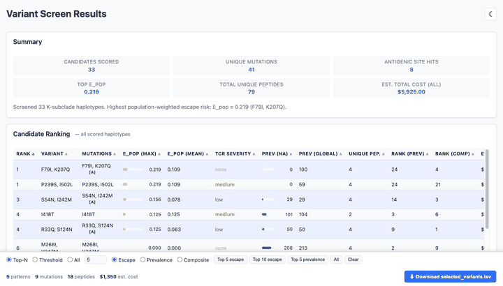
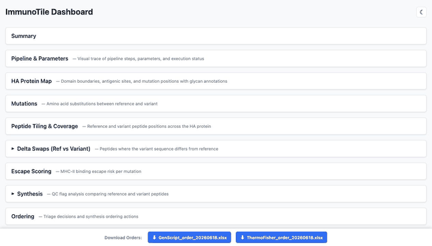
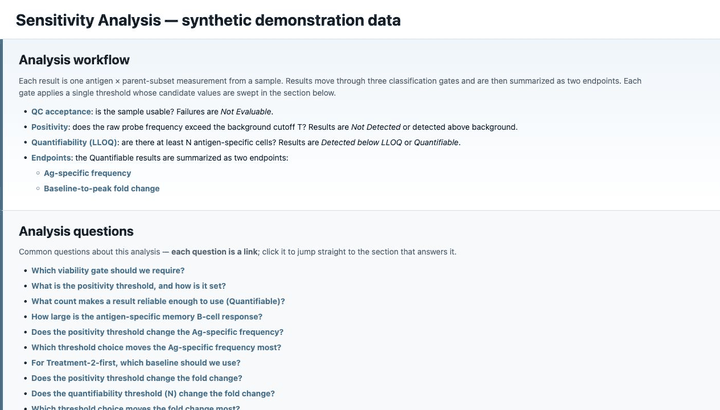

# Data Analysis HTML Gallery

This repository showcases bioinformatics analysis results and pipeline outputs rendered as interactive HTML reports. The pages are published with GitHub Pages and are intended to be easy to open, share, and review without needing to rerun the original analysis environment.

Click a report title, live-report link, or preview GIF to open the rendered dashboard.

## Live Reports

| Report | Rendered GitHub Pages link |
| --- | --- |
| CITE-seq Rare Cell Type Gating Strategy | [Open rendered HTML](https://yyw-informatics.github.io/Data_Analysis_htmls/marker_gating_diagram.html) |
| Variant Screen Results | [Open rendered HTML](https://yyw-informatics.github.io/Data_Analysis_htmls/variant_screen_dashboard.html) |
| ImmunoTile Dashboard | [Open rendered HTML](https://yyw-informatics.github.io/Data_Analysis_htmls/immunetile_dashboard.html) |
| Flow Sensitivity Analysis | [Open rendered HTML](https://yyw-informatics.github.io/Data_Analysis_htmls/flow_sensitivity_analysis_dashboard.html) |

## Featured Reports

### [CITE-seq Rare Cell Type Gating Strategy](https://yyw-informatics.github.io/Data_Analysis_htmls/marker_gating_diagram.html)

This interactive diagram documents a CITE-seq classification strategy for rare immune cell populations across 16 libraries. It combines QC filters, RNA score gates, ADT marker gates, confidence annotations, and a reference table linking subset calls to flow-style marker definitions; clicking on cell-type boxes opens literature-review notes with links to the original papers supporting the classification choices.

### [Variant Screen Results](https://yyw-informatics.github.io/Data_Analysis_htmls/variant_screen_dashboard.html)

This dashboard summarizes a K-subclade HA variant screen, ranking candidate haplotypes by population-weighted MHC-II escape risk, sequence prevalence, antigenic-site involvement, and peptide synthesis cost. It is useful for triaging which circulating variants should be prioritized for peptide design, immune escape follow-up, or experimental screening.

### [ImmunoTile Dashboard](https://yyw-informatics.github.io/Data_Analysis_htmls/immunetile_dashboard.html)

This dashboard presents an HA peptide-tiling and immunoinformatics pipeline from sequence QC through mutation mapping, peptide coverage, MHC-II escape scoring, synthesis triage, and pool assignment. It connects variant biology to practical assay design decisions by showing where mutations fall, which peptide windows carry them, and which candidates may need ordering or pooling attention.

### [Flow Sensitivity Analysis](https://yyw-informatics.github.io/Data_Analysis_htmls/flow_sensitivity_analysis_dashboard.html)

This report explores how flow-cytometry analysis choices affect antigen-specific B-cell readouts in a synthetic demonstration dataset. It walks through QC acceptance, positivity thresholds, quantifiability/LLOQ gates, antigen-specific frequency, and baseline-to-peak fold-change endpoints so that threshold robustness can be evaluated transparently.

## Repository Contents

- Static HTML dashboards and diagrams in the repository root.
- Supporting assets for the flow sensitivity dashboard in `sensitivity_dashboard_assets/`.
- README preview GIFs in `readme_assets/`.
- No installation is required to view the reports through GitHub Pages.
